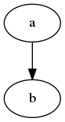

=======================
HERMOD processing suite
=======================

:Authors: 

        Joakim Möller <joakim.moller@molflow.com>, Donal Murtagh
        <donal.murtagh@chalmers.se>, Joachim Urban <joaurb@chalmers.se>

:Version: 
        
        0.2 

:Date:

        2010-10-01

:Abstract: 

        Hermod is a part of the Odin processing chain - automating level1b data
        to level2 data. This document describes the installation, configuration
        and function of the program suite. In short Hermod prepares
        requirements such as external data files and launches a Qsmr session
        when all requirements are met.

.. .. raw:: pdf
..        
..        PageBreak

.. contents:: 
.. target-notes::
.. sectnum::

Level2 processing chain - Hermod
================================

The processing chain program suite is a set of python modules that provides an
information system that makes it possible to track every single Odin Level1
file and choose a suitable processor to make higher level data i.e. Level2
data.
 
Hermod is a part of the Odin processing chain making high level information
from calibrated satellite data to very high level data ie. Human understandable
data and possibly data collected and aggregated over longer time periods.

Overview
--------

The Hermod suite are written mostly in Python_ and small part of the code is
written in C with Python's C-api to extend Pythons capabilities to
interact with different tools in the Processing chain.

Meta data from calculations made by Qsmr is stored in a database and
data is stored in files at the file system. 

Hermod is the collection name for the processing chain. The name Hermod was
chosen after one of the sons of Odin - Hermod known for his speed. 

The Hermod processing system can be seen as a set of scripts that glues Qsmr's
calculations and its results into the database. Hermod also uses those result
to find out what data is missing or what can be calculated for the moment ie.
all prerequisites for starting Qsmr calculations are resolved. Hermod also
serves other automated systems like IASCO model with data.

.. .. _Python: http://python.org

Required dependencies - Installation and configuration
======================================================

The Odin processing chain and Hermod make use of third party software.
They are all based on some type of open source license like GNU GPL or BSD
license.

Hermod is built to run on Ubuntu Linux 10.04 (server version) but may work on
different Ubuntu versions as well as other POSIX OS:es probably even on windows.

Hermod needs other components to work properly:

Python_ :

        Hermods core is implemented in Python 2.6. But other versions may also
        work. Hermod uses a lot of external packages see below.

MySQL_ :

        Relational database to manage meta data. Database installation for this
        project i discussed in `Installation of the Database`_

Torque_ :

        Torque is a Cluster Resource Manager.  Documentation and detailed
        installation instructions can be found at Torque_ documentation pages.
        Site specific configuration will be discussed in `Torque
        configuration`_ section.

Maui_ :
        
        The Cluster Scheduler only site specific setup vill be noted in `Maui
        configuration`_

.. _Python: http://python.org/
.. _MySQL: http://dev.mysql.com/doc/refman/5.1/en/
.. _Torque: http://www.clusterresources.com/products/torque/docs
.. _Maui: http://www.clusterresources.com/products/maui/docs

On a Ubuntu 10.04 LTS machine for developing Hermod the following apt-packages
need to be installed:

.. code-block:: txt 
        
      gfortran 
      libatlas-base-dev 
      libblas-dev 
      libfreetype6-dev
      libfuse-dev 
      libgeos-dev
      libhdf4g-dev
      libjasper-dev
      libjpeg62-dev
      libmysqlclient-dev
      libpng12-dev
      libtorque-dev 
      openssh-server 
      pkg-config 
      python-dev 
      python-matplotlib 
      python-numpy 
      python-scipy 
      python-virtualenv
      python-virtualenv 
      subversion 
      torque-dev 
      ubuntu-dev-tools 
      vim-nox
      zlib1g-dev

Installation of the Database
-----------------------------
 
Configuration of the database is minimal - Hermod works fine on a standard apt
installation of the package. But further tuning may increase performance
significantly.  See `Appendix A - MySQL create script`_ and `Appendix B
- MySQL Table layout`_ for database and table layout. 

On the nodes at least ``libmysqlclient`` needs to be installed.

Torque configuration
--------------------
 
Two types of Torque installations are required - one server installation and
several client installations on each node in the cluster. The server
installation manages the queueingsystem and needs to know about all clients
(computee nodes) in the cluster. The clients does only need to know about the
server.

 
Torque client configuration
___________________________
 
A site-specific installation script
``/misc/apps/torque-package-mom-linux-x86_64.sh`` provided all configuration
needed at the client. But some additional configuration is needed to provide
the per session temp directory.

The following script makes all steps in the installation process.

.. code-block:: txt

        #!/bin/bash
        # A script to install, prepare and start a node
        # run as root

        aptitude purge torque-mom torque-client -y
        sh /misc/apps/torque-package-mom-linux-x86_64.sh --install
        cp /misc/apps/prologue.user /var/spool/torque/mom_priv/
        cp /misc/apps/epilogue.user /var/spool/torque/mom_priv/
        ldconfig
        pbs_mom

An important part of the processing system is the scripts at the client that
creates a temporary directories before a processing starts and removes it when
processing is finished. These scripts runs whether or not the processing was
successful or not.

Torque server configuration
___________________________
 
A site-specific installation script ``torque-package-server-linux-x86_64.sh``
installs binaries and libraries and some basic configuration. Editing
configuration files to reflect connected nodes and their capabilities is
necessary.

The file ``/var/spool/torque/server_priv/nodes`` defines the computee nodes:

.. code-block:: txt

        glass np=8 hermod node x86_64
        sard np=2 hermod node x86_64 
        ...

The attributes hermod, node and x86_64 specifies different capabilities en each
node. 'x86_64' tells us the architecture on the node is 64 bits. 'hermod'
states that hermod, Qsmr and Q-pack in installed and works correctly. The last
attribute shows us the computer is a node with no other users than the torque
queue operates the computer. 'desktop' would state it is a workstation with
human users.

Some additional settings con be done through torque's configuration program
``qmgr``. A printout of Torque server settings generated with ``qmgr -C 'print
server'`` can be found in `Appendix C - Torque server settings`_.

Torque starting and stopping
____________________________

There are currently no system V init scripts implemented. Starting and stopping
server and nodes is manual. There is no problem shutting off a node before the
server but the running job at the node will be killed. If server is stopped the
current queue will be saved and the current running jobs at the moms will
continue. When server is started again moms will report their finished jobs. 

start server at torque_host:

.. code-block:: txt

        $ /usr/local/sbin/pbs_server

start moms at nodes:

.. code-block:: txt

        $ /usr/local/sbin/pbs_mom

stop moms at nodes:

.. code-block:: txt

        $ /usr/local/sbin/momctl -s

stop server at torque_host:

.. code-block:: txt

        $ /usr/local/bin/qterm -t immediate

Maui configuration
------------------

The main configuration file can be found on torque_host
(``morion.rss.chalmers.se``).

         /usr/local/maui/maui.cfg

Full configuration file can be found in `Appendix D - Maui configuration`_.
This setup restrict one user to take all resources at once enforcing Odin
processing always have at least a minimum of processor available but also
giving users access to the queue.

start the scheduler:

.. code-block:: txt

        $ /usr/local/maui/sbin/maui

stop the scheduler:

.. code-block:: txt

        $ /usr/local/maui/bin/schedctl -k

HERMOD
======

Overview
--------

Hermod is a program suite written in Python that wraps around QSMR and inserts
meta data in to the SMR database. Hermod runs regularly and decides when to run
QSMR according to information Hermod can find in the SMR Database. Hermod
provides a fully automatic processing system for processing data from Level1
data to Level2 data.

Package details
---------------

Hermod is divided into several smaller entities that provide specific
functionality. The current status of the source code is still in a form of
transition from one package to more and smaller sub packages.

odin.hermod

The odin.hermod package is the package which is responsible for the information
and bookkeeping parts of hermod i.e keep track of file transactions,
file dependencies and finally submitting jobs to the queuing system

odin.config

The odin.config i more or less a configuration package Hermod and Iasco shares
this package

odin.iasco

This runs and manages the IASCO model.

HERMOD Installation
-------------------

For the moment hermod is running from the development source i.e. from the
directory ``~odinop/hermod_jm`` for Ubuntu 10.04 and  ``~odinop/hermod_glass``
for 9.08 this directory is checked out from svn. This is not by any means the
ideal way to maintain a piece of software. This is a temporary solution.

Best way to continue development is to separate development and production.
First all processing nodes and servers in the system need to have the same OS
version (Ubuntu 10.04 LTS). Using the same OS makes it possible to run Hermod
from on single installation shared by NFS.

A set of compiled hermod packages exits in ``/misc/apps/odinsite``. The
installation of hermod is controlled by zc.buildout installation. This way
buildout pins down the specific version of each dependency package.

This is the cycle to use when developing for Hermod.

 #. check out from svn
 #. create environment
 #. develop
 #. run tests - preferable unit or system tests
 #. check in - 
 #. Release - create binary eggs and copy them to production site
 #. deploy - installing binary packages
 #. remove development files

Notes Step 1-2 is normally done once. Step 3-4 iterates many times.Step 3-5 when tests are sucessful. Step 9 is seldom made.

Developers installation
_______________________

The source of  hermod is available at `Chalmers' Subversion repository`__ . A
developers installation is a isolated installation which is running in its own
environment - from here it's possible to run unit test and other functional
testing. With a correct .hermod.config and .hermod.config.secret it's possible
to connect to the database or PDC. (Future work: It would even be possible to
have a standalone database with a small data set to run off site tests).

Once developers build packages in the development environment described above.
Packages selected to be "released" are copied to ``/misc/apps/odinsite``.

To have a copy of hermod running locally for development do the following:

.. code-block:: txt

        svn co http://svn.rss.chalmers.se/svn/odinsmr/hermod/trunk hermod
        virtualenv -p /usr/bin/python2.6 hermod
        cd hermod
        bin/python2.6 bootstrap.py
        bin/buildout

.. _svn: http://svn.rss.chalmers.se/svn/odinsmr/hermod

__ svn_

Tests
______

To ensure quality and to simplify for other developers. Unittests are written for some parts of Hermod. Unittests makes sure that the tested function or procedure does what it's  meant for.

Example: How to run a full unittest suite for a package.

.. code-block:: txt

    .. src/odin.ecmwf$> ../bin/odinpy setup.py test

Example: how to run a specific testcase.

.. code-block:: txt

    .. src/odin.ecmwf/odin/ecmwf/tests$> ../../../../../bin/odinpy zpt2_create_test.py

Developing and creating eggs for production
___________________________________________

Once you have a `Developers installation`_ you can change or correct Hermod's behaivor. If you want to deploy your changes you have to change the version variable in the setup.py file. When tests are ok - commit your changes to svn. If you don't have any test for your code - consider to add a test to cover your code.

To build installable eggs use the python interpretor created with buildout.

.. code-block:: txt

        $ cd <devel>
        $ cd src/odin.hermod
        $ ../../bin/odinpy setup.py bdist_egg

To install an egg in a productoin environment.

.. code-block:: txt

       $ cd <production>
       $ bin/easy_install -U -f <where the eggs are> odin.hermod

 

Installation in Production environment
______________________________________

Released packages can be installed in the production environment by using
Python's ``easy_install`` utility.

Packages can be installed either into the system environment or into a virtual
python environment. (Preferably the virtual environment to not clutter the
system installation)

.. code-block:: txt
	
	virtualenv <dir>
	cd <dir>
	bin/easy_install -f /misc/apps/odinsite \
		odin.config \
		odin.hermod \
		odin.iasco

Later on updates can be installed by:

.. code-block:: txt
	
	cd <dir>
	bin/easy_install -f /mist/apps/odinsite -U \
		odin.hermod

Running scripts manually
________________________

All scripts can be run manually. Take a look at the crontab installed at odinops account on torque_host.

.. code-block:: txt

	odinop@torque_host:~$ crontab -l
	####
	## odin.hermod 
	## 2011-08-01 joakim.moller@molflow.com
	## Scripts to download and make files to resolve dependencies for L2 processing
	##
	# Get missing or updated l1b-files from pdc
	45 02 * * * /home/odinop/hermod_production_2.6/bin/hermodgetlevel1 
	## Get files from nilu
	#45 03 * * * /home/odinop/hermod_jm/bin/hermodgetwinds
	## get files from ecmwf
	45 03 * * * /home/odinop/hermod_production_2.6/bin/hermodcreateecmwf
	## remove old gribfiles (gribfiles older than 14 days)
	57 11 * * * find /odin/external/ecmwfNCD/trash -type f -ctime +14 -delete
	## Make zpts
	#45 04 * * * /home/odinop/hermod_jm/bin/hermodmakezpt > /home/odinop/crontab_logs/zpt.txt
	## Make ptzs
	45 04 * * * /home/odinop/hermod_production_2.6/bin/hermodcreateptz
	## relink files
	40 */2 * * * /home/odinop/hermod_production_2.6/bin/hermodrelink
	## Run qsmr on l1b files not sucessfully processed before, or on updated l1b files
	45 06 * * * /home/odinop/hermod_production_2.6/bin/hermodrunprocessor > /home/odinop/crontab_logs/processor.txt
	## Mail logs 
	30 09 * * * tail -n 500 /home/odinop/hermod_systemlogs/system.log | sendemail -s mail.chalmers.se -f hermod@rss.chalmers.se -t joaurb@chalmers.se donal@chalmers.se -u 'Hermod logs' -q
	####

Data model
----------

The database consists of a number of loosely connected tables with records
(rows) describing meta data about satellite measurement or metadata of files stored on disk.

The Hermod data model is pretty simple. All tables are 'knitted' together with a
'id' field. For example in the 'level1'-table the logical key that identifies
each row is the fields 'orbit','calversion' and 'freqmode'.

level1
______

This table contains the metadata from the process of producing 'Level 1' data at Onsala. One orbit of Odin corresponds to at least 2 rows in the database, one for each combination of freqmode, calversion and backend.
        
.. code-block:: txt

        id -> orbit, calversion, backend, freqmode -> 'records in level1'

status
______

Some errormessages from the level0 to level1 process are captured in this table.

.. code-block:: txt

        id -> status,errmsg

The 'id'-field is included in the 'level2'-table to make it possible to find
all level2 products derived from a 'level1' record.

level2:
        
.. code-block:: txt

        id, fqid, scanno -> 'records in level2-table'

level2files:
        
.. code-block:: txt

        id, fqid -> 'records in level2files-table'

Downloading level1 files
________________________

Hermod searches the database to find new files available on PDC but not in the
local file storage.

.. code-block:: sql

        select l1.id,l1.filename,l1.logname
        from level1 l1
        join status s on (l1.id=s.id)
        left join level1b_gem l1bg on (l1.id=l1bg.id)
        where s.status and (l1bg.id is null or l1bg.date<l1.uploaded) 
                and s.errmsg='' and l1.calversion in (6,7);

Finding scans available for processing
______________________________________

To find new orbits in the database that has not already been processed to a
level2 file.

.. code-block:: sql

        select distinct l1.id,l1.back backend,l1.orbit orbit,v.id fqid,
                v.qsmr version, l1.calversion,a.name,v.process_time
        from (
                select orbit,id,substr(backend,1,3) back,freqmode mode,
                        calversion from level1
                join status using (id)
                join level1b_gem l1g using (id)
                where status and l1g.filename regexp ".*HDF" 
                        and not locate(',',freqmode)
        union (
                select orbit,id,substr(backend,1,3) back,
                        substr(freqmode,1, locate(',',freqmode)-1) mode,
                        calversion from level1
                join status using (id)
                join level1b_gem l1g using (id)
                where status and l1g.filename regexp ".*HDF" 
                        and locate(',',freqmode)
              )
        union (
                select orbit,id,substr(backend,1,3) back,
                        substr(freqmode from locate(',',freqmode)+1) mode,
                        calversion from level1
                join status using (id)
                join level1b_gem l1g using (id)
                where status and l1g.filename regexp ".*HDF" 
                        and locate(',',freqmode)
              )) as l1
        join versions v on (l1.mode=v.fm)
        join Aero a on (v.id=a.id) 
        left join level2files l2f on 
                (l1.id=l2f.id and v.id=l2f.fqid and v.qsmr=l2f.version)
        left join statusl2 s2 on 
                (l1.id=s2.id and v.id=s2.fqid and v.qsmr=s2.version)
        where v.active and l2f.id is null and l1.calversion=6 
                and (proccount is null or proccount<4)
        order by orbit desc,fqid   

Queuing and execution
_____________________

A "job" is defined from the look up in the previous section. Information
about the processing is sent to a queue for later execution. The Resource
system that handles the queue and the execution nodes in the computing cluster
(``glass``,``larimar``,``titanite``,``...``) is Torque_. 

Basically the "job" is a shell script sent to another machine for execution.

The script ``run processor`` puts  the shell script in queue with different
input parameters to  run on the computee nodes.

Processing
__________

The ``hermodprocessor``-script executes the main-function in
``odin.hermod.processor``-module. This module looks in the database to find
level1b records which not have as many corresponding level2 records as hermod
expects.

When Hermod detects a job to run - Hermod sends a wrapped Qsmr job to the
processing cluster and collects the results and puts them in the database and the
file system.

Troubleshooting
===============

A job is stale - showing negative time whith qstat:

The execution service on the node is probably dead. Use `qstat -rn` to see what
node the job runs on, also note the jobnumber. Log in as root at the stale
node. Start the mom by `pbs_mom`. When the mom is started lauch `momctl -c
<jobnumber> to clear the nodes status.

Appendix A - MySQL Create script
================================

.. This script is available at the SMILES svn-repository_
.. 
.. .. _svn-repository: http://svn.rss.chalmers.se/svn/smiles/branches/jmbranch2/docs/database_model.sql

Appendix B - MySQL Table layout
===============================

.. .. image:: database_model.png
 
Appendix C - Torque server settings
===================================

.. code-block:: txt

        #
        # Create queues and set their attributes.
        #
        #
        # Create and define queue batch
        #
        create queue batch
        set queue batch queue_type = Execution
        set queue batch resources_default.nodes = 1
        set queue batch resources_default.walltime = 01:00:00
        set queue batch enabled = True
        set queue batch started = True
        #
        # Create and define queue new
        #
        create queue new
        set queue new queue_type = Execution
        set queue new resources_default.nodes = 1
        set queue new resources_default.walltime = 01:00:00
        set queue new enabled = True
        set queue new started = True
        #
        # Create and define queue new
        #
        create queue rerun
        set queue rerun queue_type = Execution
        set queue rerun resources_default.nodes = 1
        set queue rerun resources_default.walltime = 01:00:00
        set queue rerun enabled = True
        set queue rerun started = True
        #
        # Set server attributes.
        #
        set server scheduling = True
        set server acl_hosts = torque_host
        set server managers = root@torque_host
        set server operators = root@torque_host
        set server default_queue = batch
        set server log_events = 511
        set server mail_from = adm
        set server query_other_jobs = True
        set server scheduler_iteration = 600
        set server node_check_rate = 150
        set server tcp_timeout = 6
        set server mom_job_sync = True
        set server keep_completed = 300
        set server auto_node_np = True
        set server next_job_number = 18315

Appendix D - Maui configuration
===============================

The only configuration file is in /usr/local/maui/maui.cfg:

.. code-block:: txt

        # maui.cfg 3.3

        SERVERHOST            torque_host
        # primary admin must be first in list
        ADMIN1                root e0joakim jo
        ADMIN2		      donal odinop
        ADMIN3		      all

        # Resource Manager Definition

        RMCFG[base] TYPE=PBS

        # Allocation Manager Definition

        AMCFG[bank]  TYPE=NONE

        # full parameter docs at http://supercluster.org/mauidocs/a.fparameters.html
        # use the 'schedctl -l' command to display current configuration

        RMPOLLINTERVAL        00:00:30

        SERVERPORT            42559
        SERVERMODE            NORMAL

        # Admin: http://supercluster.org/mauidocs/a.esecurity.html

        LOGFILE               maui.log
        LOGFILEMAXSIZE        10000000
        LOGLEVEL              3

        # Job Priority: http://supercluster.org/mauidocs/5.1jobprioritization.html

        QUEUETIMEWEIGHT       1

        # FairShare: http://supercluster.org/mauidocs/6.3fairshare.html

        FSPOLICY              PSDEDICATED
        FSDEPTH               7
        FSINTERVAL            6:00:00
        FSDECAY               0.80

        FSWEIGHT 10
        CREDWEIGHT 100
        USERWEIGHT 0
        GROUPWEIGHT 0
        CLASSWEIGHT 100
        SERVICEWEIGHT 1
        QUEUETIMEWEIGHT 1
        FSCLASSWEIGHT 100
        FSUSERWEIGHT 0

        # Throttling Policies: http://supercluster.org/mauidocs/6.2throttlingpolicies.html

        # NONE SPECIFIED

        # Backfill: http://supercluster.org/mauidocs/8.2backfill.html

        BACKFILLPOLICY        FIRSTFIT
        RESERVATIONPOLICY     CURRENTHIGHEST

        # Node Allocation: http://supercluster.org/mauidocs/5.2nodeallocation.html

        NODEALLOCATIONPOLICY  MINRESOURCE

        # QOS: http://supercluster.org/mauidocs/7.3qos.html

        # QOSCFG[hi]  PRIORITY=100 XFTARGET=100 FLAGS=PREEMPTOR:IGNMAXJOB
        # QOSCFG[low] PRIORITY=-1000 FLAGS=PREEMPTEE

        # Standing Reservations: http://supercluster.org/mauidocs/7.1.3standingreservations.html

        # SRSTARTTIME[test] 8:00:00
        # SRENDTIME[test]   17:00:00
        # SRDAYS[test]      MON TUE WED THU FRI
        # SRTASKCOUNT[test] 20
        # SRMAXTIME[test]   0:30:00

        # Creds: http://supercluster.org/mauidocs/6.1fairnessoverview.html

        USERCFG[DEFAULT]      FSTARGET=20 MAXJOB=10
        USERCFG[odinop]       FSTARGET=50 MAXJOB=50
        # USERCFG[john]         PRIORITY=100  FSTARGET=10.0-
        # GROUPCFG[staff]       PRIORITY=1000 QLIST=hi:low QDEF=hi
        #CLASSCFG[batch]       FLAGS=PREEMPTEE
        CLASSCFG[batch]       FLAGS=PREEMPTEE PRIORITY=10000
        # CLASSCFG[interactive] FLAGS=PREEMPTOR
        CLASSCFG[batch] FSTARGET=40.0
        CLASSCFG[rerun] FSTARGET=20.0
        CLASSCFG[new] FSTARGET=40.0

